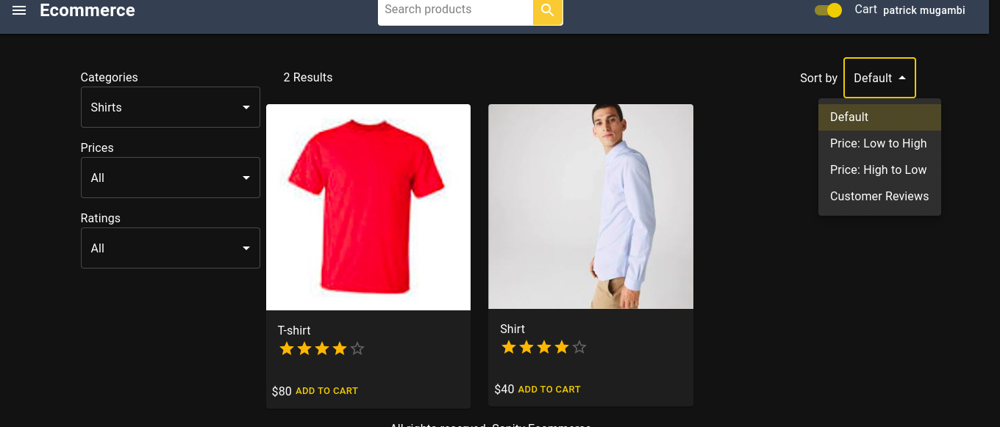

# Sanity ecommerce platform

> 
> Built with Next and Sanity



## Build Setup:frontend

``` bash

# install dependencies
npm install
# create .env file & add url
touch .env & inside env file add environment variables as specified in .env.example
# serve with hot reload at localhost:3000
npm run dev
# build for production with minification
npm run build
# build for production and view the bundle analyzer report
npm run build --report
```
### Build Setup: backend

```bash
# navigate to server directory
cd sanity
# install dependancies
sanity install
# start sanity server
sanity start

## 📝 License

This project is free to use
